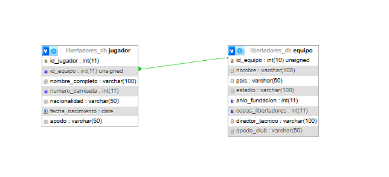

# TPE Web 2 - Parte 1 

## Integrantes:
  *Agustin Giano agustingiano@gmail.com
  *Vicky Dobler doblervictoria3@gmail.com

## Tematica TPE
    *Copa Libertadores: Gestión de Equipos, Jugadores y resultados.

## Descripción de la temática 
    *Este sitio web dinámico está diseñado para la visualización y administración de los equipos de la copa libertadores y sus resultados.  El modelo de datos sigue una relación de 1 a N entre Equipo y Jugador.
    El sistema permitirá el acceso público para la visualisacion de los resultados, etc de la copa, mientras que las tareas de gestión (crear, modificar y eliminar ítems) estarán reservadas exclusivamente para el administrador.

---

### Diagrama de Entidad Relación (DER) 
    A continuación se presenta el modelo de datos diseñado para el proyecto: 

